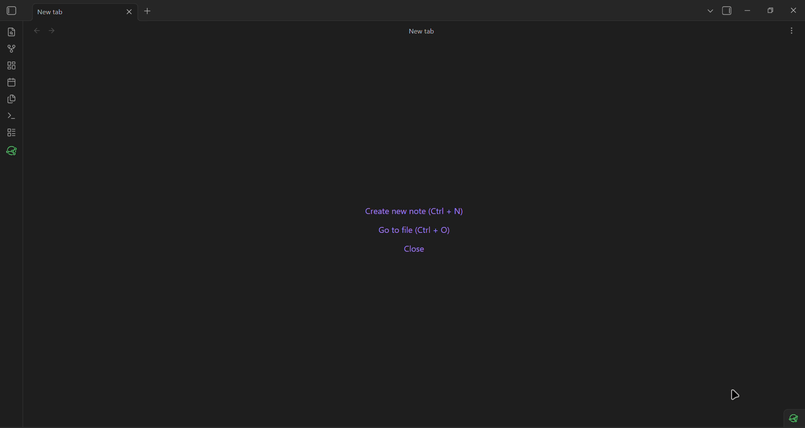
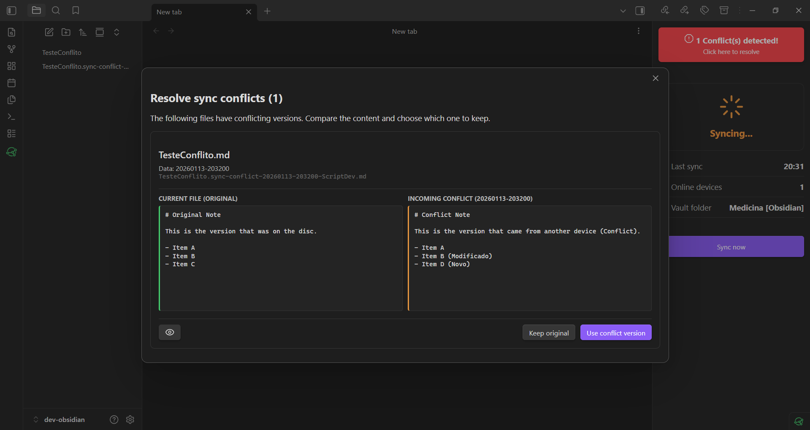

  
  
    Syncthing Manager for Obsidian
  

  <b>Control, monitor, and manage your Syncthing synchronization directly from Obsidian.</b>

  
  
  
  

 

This plugin acts as a bridge to your local Syncthing API, providing real-time status updates, a powerful conflict resolver, and tools to keep your vault healthy across Desktop and Mobile devices.

## Table of Contents

-   [Features](#features)
-   [Quick Start](#quick-start)
-   [Android Setup (Critical)](#android-setup-critical)
-   [Conflict Resolution](#conflict-resolution)
-   [Ignoring Files (.stignore)](#ignoring-files-stignore)
-   [FAQ & Troubleshooting](#faq--troubleshooting)
-   [Installation](#installation)

---

## Features

-   **Status Monitoring:** Real-time visibility of your vault status (Synced, Syncing, or Disconnected) via the Status Bar or Side Panel.
-   **Conflict Resolver:** Intelligent detection of `.sync-conflict` files with a side-by-side diff view for safe resolution.
-   **.stignore Editor:** Manage ignored files (such as `workspace.json`) directly within Obsidian using built-in templates.
-   **Mobile Optimized:** Responsive Side Panel View designed specifically for Android integration.
-   **Localization:** Full support for English, Portuguese (Português-BR), and Russian.

---

## Quick Start

1. **Install:** Use [BRAT](#installation) or download the latest release.
2. **Get API Key:** In Syncthing, navigate to **Actions** > **Settings** > **General** and copy the **API Key**.
3. **Configure:** - Open Obsidian Settings > **Syncthing Manager**.
    - Paste your API Key and click **Test Connection**.
    - **Note:** Select your **Vault Folder** from the dropdown menu to track specific vault events.

---

## Android Setup (Critical)

To use this plugin on Android (via _Syncthing-Fork_ or the official app), you must allow local HTTP connections.

> [!WARNING] > **HTTPS Restriction:** Obsidian Mobile cannot connect to self-signed HTTPS certificates on localhost. You **must disable HTTPS** in the Syncthing App settings. Since the address is restricted to `127.0.0.1`, your traffic remains local and secure.

1. Open Syncthing App > **Settings** > **GUI**.
2. Set **GUI Listen Address** to `127.0.0.1:8384`.
3. **Disable** "Use HTTPS for GUI".
    - _Note: Ensure you have cleared "GUI Authentication User/Password" fields, otherwise the app may enforce HTTPS._
4. Restart the Syncthing App.
5. In Obsidian, ensure **Use HTTPS** is toggled **OFF**.

---

## Features Guide

### Conflict Resolution

When a sync conflict occurs, a status alert will appear in the Syncthing View.

1. Click the alert to open the **Conflict Resolver**.
2. Select **Compare Content** for a side-by-side comparison.
3. Choose **Keep Original** (removes conflict file) or **Use This Version** (overwrites current file).

### Ignoring Files (.stignore)

1. Open **Settings** > **Syncthing Manager** > **Edit .stignore**.
2. Use "Add Common Patterns" to ignore `workspace.json` or cache files to prevent UI inconsistencies between devices.

---

## FAQ & Troubleshooting

**Q: Plugin status shows "Disconnected".**

-   Verify that the Syncthing service is running on your device.
-   Ensure the API Key in settings matches your Syncthing configuration exactly.

**Q: Is it secure to disable HTTPS on Android?**

-   Yes. By setting the **GUI Listen Address** to `127.0.0.1`, access is restricted exclusively to applications running on the same device.

---

## Installation

### BRAT (Beta)

1. Install the **BRAT** plugin from the Obsidian Community Store.
2. Add this repository URL: `https://github.com/gustjose/obsidian-syncthing-manager`.
3. Enable **Syncthing Manager**.

---

## Contributing

Contributions are welcome! If you encounter bugs or have feature requests, please open an issue.

-   **Build:** `npm run build`
-   **Dev:** `npm run dev`

---

## License

This project is licensed under the [MIT License](LICENSE).  
Copyright © 2025 Gustavo Carreiro.

Distributed under the MIT License. See `LICENSE` for more information.
